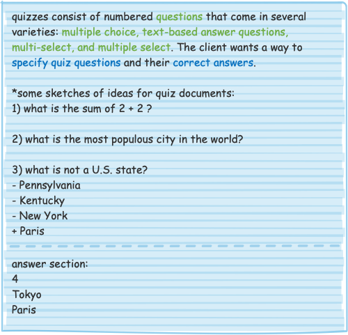
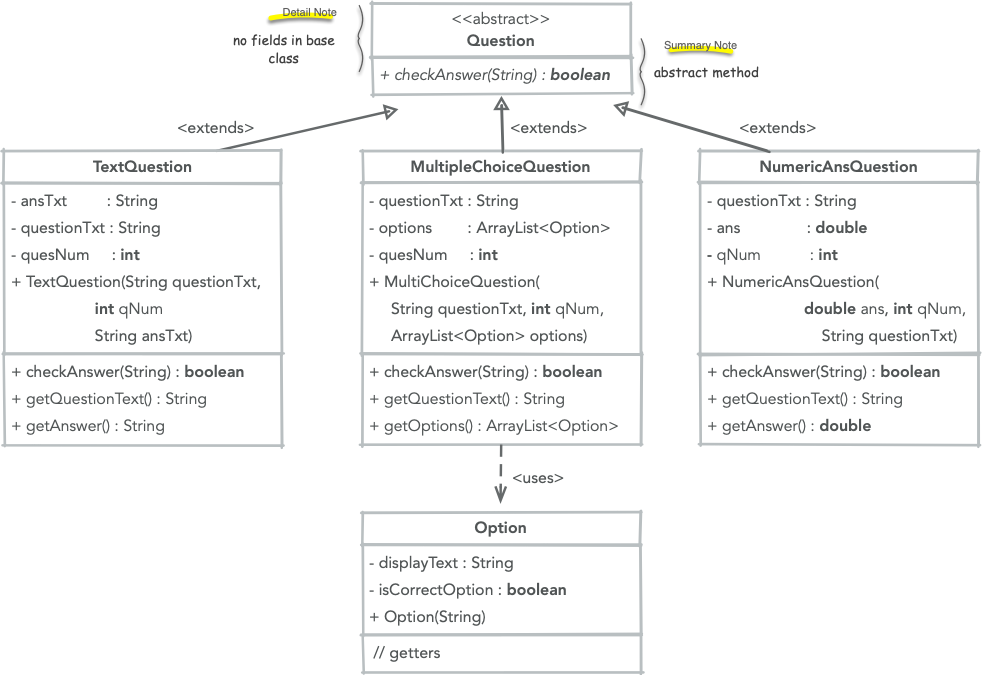

# Quizlet Madness

In this assignment you will practice basic OOP design by implementing a
fictional quiz administration system. In the process, you will utilize unit 
testing to help build confidence in your design, UML class diagrams to document 
your designs, and generally practice building out suitable object models.

## The setup

You are working as part of a small software consulting firm, *AcmeSoftware (LLC)*,
and have been tasked by a client with creating a small application that can 
administer and assess quizzes -- similar to the sort given in bigger LMS 
(**L**earning **M**anagement **S**ystems, like Canvas).

Your parter has already been in communication with the client and has already 
started the design process. Their raw notes and doodles are below:

Your partner, buoyed by their initial progress in employing the CRC method on 
the scenario above, has taken the liberty of sketching out a UML class diagram
for representing quiz questions:

## Extension points/todos (pick one for this project)

* add quiz validation checking logic that ensures quizzes are "well-formed" e.g.
-- ensuring the questions are numbered correctly, and any other validation checks
for questions that you can think of.
* add an auto grader that assigns a number grade to a given quiz 
(the `checkAnswer` abstract method in the UML diagram above should help with 
this).
* **(stretch option)** add a *parser* that reads a .txt file containing the quiz 
in a format like your colleague sketched out and parses it into a valid quiz 
object model.. en eas(ier) approach to this is to stop and report on the first 
occurrence of an error in a quiz document -- the harder version would be to 
attempt error recovery.

Lastly, provide unit tests for your code and include in your repo a 
`reflections.md` (or: txt, pdf) that summarizes your work, the directions you 
went, and parts you more difficult. Provide in the repo (or document itself) a pdf or png
of your updated UML class diagram for final object model. Feel free to use the 
software of your choice to create this (figma, Canva, visio) -- I recommend [draw.io](https://app.diagrams.net/)

# Handin

When you are ready to submit (or simply want to 'checkin' your work for the day), 
open the terminal, cd to the project directory, make a commit by typing:

> git commit -am "message goes here"

then follow this up with a

> git push origin main
